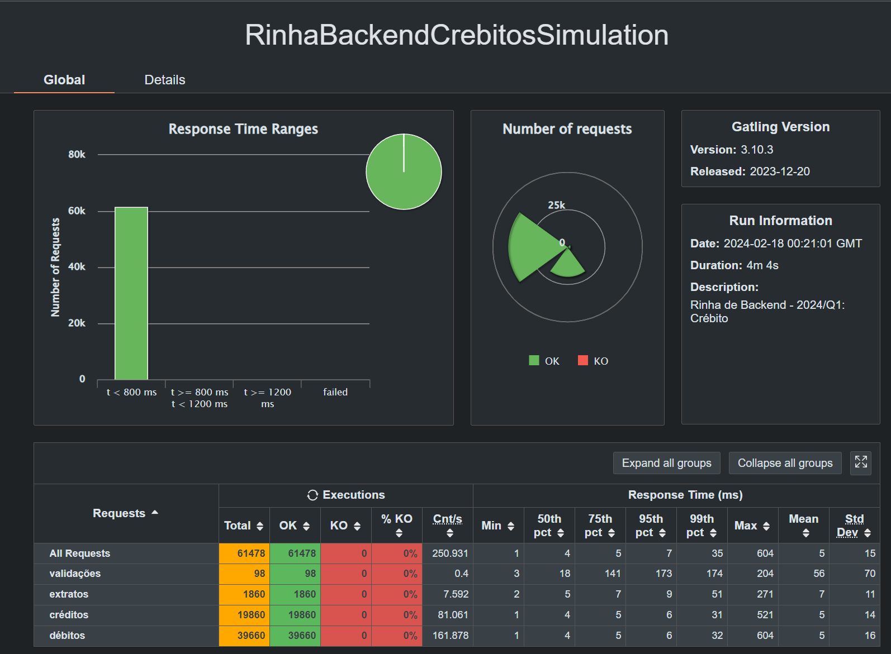

# Rinha de Backend - Segunda Edição

Repositório para testar meus conhecimento na [rinha de backend 2ª edição - 2024/Q1](https://github.com/zanfranceschi/rinha-de-backend-2024-q1).
Fiz meu projeto com a linguagem que tenho mais conhecimento: .net 8. A [imagem](https://hub.docker.com/r/felipebossolani/rinha-de-backend-2024-q01-dotnet) está com 49.25Mb. 

## Stack

- .net 8.0
- nginx
- postgres

## Rodando o projeto

```bash
docker-compose up -d
```

## Resultados



